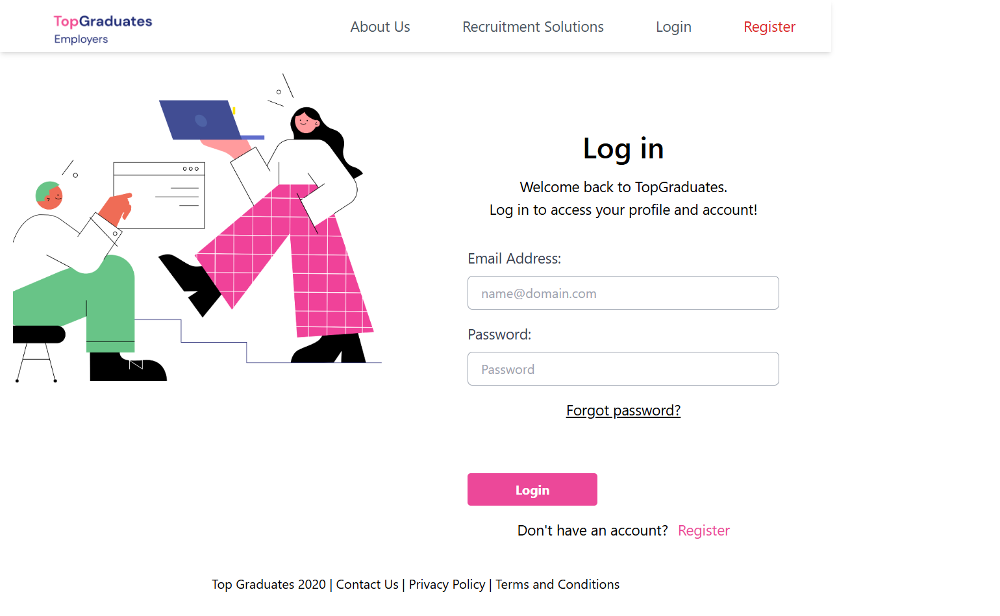

# Top-Graduates
A modern responsive recruitment platform UI built using HTML and TailwindCSS.

 Demo : https://snehavish595.github.io/Top-Graduates/

## Features

- Responsive employer onboarding flow
- Login & registration pages
- Employer profile creation
- Welcome dashboard UI
- TailwindCSS modern design
- Mobile responsive layout

## Tech Stack

- HTML5
- TailwindCSS
- JavaScript
- 


## Screenshots



## Installation

```bash
git clone https://github.com/yourusername/topgraduates.git
cd topgraduates


